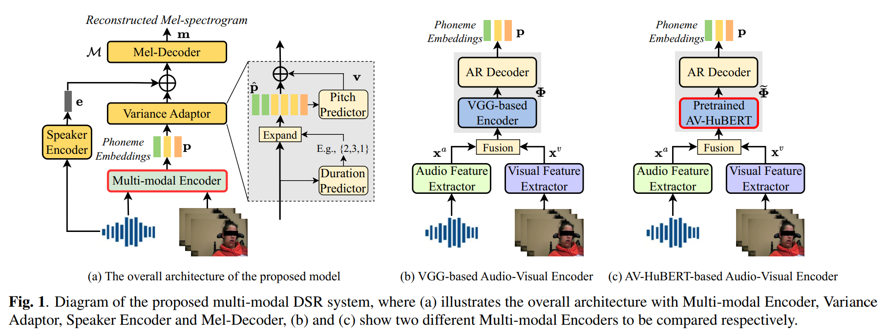

(Submitted on ICASSP 2024)

 <b>Authors</b>: <i>Xueyuan Chen, Yuejiao Wang, Xixin Wu, Disong Wang, Zhiyong Wu, Xunying Liu, Helen Meng</i> 

## 1. Abstract

Dysarthric speech reconstruction (DSR) aims to transform dysarthric speech into normal speech by improving the intelligibility and naturalness. This is a challenging task especially for patients with severe dysarthria and speaking in complex, noisy acoustic environments. To address these challenges, we propose a novel multi-modal framework to utilize visual information, e.g., lip movements, in DSR as extra clues for reconstructing the highly abnormal pronunciations. The multi-modal framework consists of: (i) a multi-modal encoder to extract robust phoneme embeddings from dysarthric speech with auxiliary visual features; (ii) a variance adaptor to infer the normal phoneme duration and pitch contour from the extracted phoneme embeddings; (iii) a speaker encoder to encode the speaker’s voice characteristics; and (iv) a mel-decoder to generate the reconstructed mel-spectrogram based on the extracted phoneme embeddings, prosodic features and speaker embeddings. Both objective and subjective evaluations conducted on the commonly used UASpeech corpus show that our proposed approach can achieve significant improvements over baseline systems in terms of speech intelligibility and naturalness, especially for the speakers with more severe symptoms. Compared with original dysarthric speech, the reconstructed speech achieves 42.1% absolute word error rate reduction for patients with more severe dysarthria levels.

## 2. Proposed model architecture

## 3. Audio samples of different model settings

- **Original**: The original dysarthric speech.
- **A-DSR**: The audio-only encoder (described in paper 2.1.1) is used for the DSR model.
- **AV-DSR**: The VGG-based audio-visual encoder (described in paper 2.1.2) is used for the DSR model.
- **AVHuBERT-DSR**: The AV-HuBERT-based audio-visual encoder (described in paper 2.1.3) is used for the DSR model.

3.1 **Text**: <i>Enter</i>

| **Original** | <audio controls><source src="./wavs/F02/original/F02_B2_C4_M2_Denoise1.1_pred_gen.wav" type="audio/wav"></audio> | **A-DSR** | <audio controls><source src="./wavs/F02/a/F02_B2_C4_M2_Denoise1.1_pred_gen.wav" type="audio/wav"></audio> |
|:---------------------------------------:|:--------------------------------------:|:---------------------------------------:|:--------------------------------------:|
| **AV-DSR** | <audio controls><source src="./wavs/F02/av/F02_B2_C4_M2_Denoise1.1_pred_gen.wav" type="audio/wav"></audio> | **AVHuBERT-DSR** | <audio controls><source src="./wavs/F02/avhubert/F02_B2_C4_M2_Denoise1.1_pred_gen.wav" type="audio/wav"></audio> |

3.2 **Text**: <i>Shift</i>

| **Original** | <audio controls><source src="./wavs/F02/original/F02_B2_C9_M5_Denoise1.1_pred_gen.wav" type="audio/wav"></audio> | **A-DSR** | <audio controls><source src="./wavs/F02/a/F02_B2_C9_M5_Denoise1.1_pred_gen.wav" type="audio/wav"></audio> |
|:---------------------------------------:|:--------------------------------------:|:---------------------------------------:|:--------------------------------------:|
| **AV-DSR** | <audio controls><source src="./wavs/F02/av/F02_B2_C9_M5_Denoise1.1_pred_gen.wav" type="audio/wav"></audio> | **AVHuBERT-DSR** | <audio controls><source src="./wavs/F02/avhubert/F02_B2_C9_M5_Denoise1.1_pred_gen.wav" type="audio/wav"></audio> |

3.3 **Text**: <i>Paragraph</i>

| **Original** | <audio controls><source src="./wavs/F02/original/F02_B2_C11_M7_Denoise1.1_pred_gen.wav" type="audio/wav"></audio> | **A-DSR** | <audio controls><source src="./wavs/F02/a/F02_B2_C11_M7_Denoise1.1_pred_gen.wav" type="audio/wav"></audio> |
|:---------------------------------------:|:--------------------------------------:|:---------------------------------------:|:--------------------------------------:|
| **AV-DSR** | <audio controls><source src="./wavs/F02/av/F02_B2_C11_M7_Denoise1.1_pred_gen.wav" type="audio/wav"></audio> | **AVHuBERT-DSR** | <audio controls><source src="./wavs/F02/avhubert/F02_B2_C11_M7_Denoise1.1_pred_gen.wav" type="audio/wav"></audio> |

3.4 **Text**: <i>Word</i>

| **Original** | <audio controls><source src="./wavs/F02/original/F02_B2_CW29_M6_Denoise1.1_pred_gen.wav" type="audio/wav"></audio> | **A-DSR** | <audio controls><source src="./wavs/F02/a/F02_B2_CW29_M6_Denoise1.1_pred_gen.wav" type="audio/wav"></audio> |
|:---------------------------------------:|:--------------------------------------:|:---------------------------------------:|:--------------------------------------:|
| **AV-DSR** | <audio controls><source src="./wavs/F02/av/F02_B2_CW29_M6_Denoise1.1_pred_gen.wav" type="audio/wav"></audio> | **AVHuBERT-DSR** | <audio controls><source src="./wavs/F02/avhubert/F02_B2_CW29_M6_Denoise1.1_pred_gen.wav" type="audio/wav"></audio> |

3.5 **Text**: <i>When</i>

| **Original** | <audio controls><source src="./wavs/F02/original/F02_B2_CW36_M3_Denoise1.1_pred_gen.wav" type="audio/wav"></audio> | **A-DSR** | <audio controls><source src="./wavs/F02/a/F02_B2_CW36_M3_Denoise1.1_pred_gen.wav" type="audio/wav"></audio> |
|:---------------------------------------:|:--------------------------------------:|:---------------------------------------:|:--------------------------------------:|
| **AV-DSR** | <audio controls><source src="./wavs/F02/av/F02_B2_CW36_M3_Denoise1.1_pred_gen.wav" type="audio/wav"></audio> | **AVHuBERT-DSR** | <audio controls><source src="./wavs/F02/avhubert/F02_B2_CW36_M3_Denoise1.1_pred_gen.wav" type="audio/wav"></audio> |

3.6 **Text**: <i>One</i>

| **Original** | <audio controls><source src="./wavs/F02/original/F02_B2_D1_M7_Denoise1.1_pred_gen.wav" type="audio/wav"></audio> | **A-DSR** | <audio controls><source src="./wavs/F02/a/F02_B2_D1_M7_Denoise1.1_pred_gen.wav" type="audio/wav"></audio> |
|:---------------------------------------:|:--------------------------------------:|:---------------------------------------:|:--------------------------------------:|
| **AV-DSR** | <audio controls><source src="./wavs/F02/av/F02_B2_D1_M7_Denoise1.1_pred_gen.wav" type="audio/wav"></audio> | **AVHuBERT-DSR** | <audio controls><source src="./wavs/F02/avhubert/F02_B2_D1_M7_Denoise1.1_pred_gen.wav" type="audio/wav"></audio> |

3.7 **Text**: <i>Seven</i>

| **Original** | <audio controls><source src="./wavs/F02/original/F02_B2_D7_M4_Denoise1.1_pred_gen.wav" type="audio/wav"></audio> | **A-DSR** | <audio controls><source src="./wavs/F02/a/F02_B2_D7_M4_Denoise1.1_pred_gen.wav" type="audio/wav"></audio> |
|:---------------------------------------:|:--------------------------------------:|:---------------------------------------:|:--------------------------------------:|
| **AV-DSR** | <audio controls><source src="./wavs/F02/av/F02_B2_D7_M4_Denoise1.1_pred_gen.wav" type="audio/wav"></audio> | **AVHuBERT-DSR** | <audio controls><source src="./wavs/F02/avhubert/F02_B2_D7_M4_Denoise1.1_pred_gen.wav" type="audio/wav"></audio> |

3.8 **Text**: <i>From</i>

| **Original** | <audio controls><source src="./wavs/F02/original/F02_B2_CW25_M7_Denoise1.1_pred_gen.wav" type="audio/wav"></audio> | **A-DSR** | <audio controls><source src="./wavs/F02/a/F02_B2_CW25_M7_Denoise1.1_pred_gen.wav" type="audio/wav"></audio> |
|:---------------------------------------:|:--------------------------------------:|:---------------------------------------:|:--------------------------------------:|
| **AV-DSR** | <audio controls><source src="./wavs/F02/av/F02_B2_CW25_M7_Denoise1.1_pred_gen.wav" type="audio/wav"></audio> | **AVHuBERT-DSR** | <audio controls><source src="./wavs/F02/avhubert/F02_B2_CW25_M7_Denoise1.1_pred_gen.wav" type="audio/wav"></audio> |

3.9 **Text**: <i>Into</i>

| **Original** | <audio controls><source src="./wavs/F02/original/F02_B2_CW66_M7_Denoise1.1_pred_gen.wav" type="audio/wav"></audio> | **A-DSR** | <audio controls><source src="./wavs/F02/a/F02_B2_CW66_M7_Denoise1.1_pred_gen.wav" type="audio/wav"></audio> |
|:---------------------------------------:|:--------------------------------------:|:---------------------------------------:|:--------------------------------------:|
| **AV-DSR** | <audio controls><source src="./wavs/F02/av/F02_B2_CW66_M7_Denoise1.1_pred_gen.wav" type="audio/wav"></audio> | **AVHuBERT-DSR** | <audio controls><source src="./wavs/F02/avhubert/F02_B2_CW66_M7_Denoise1.1_pred_gen.wav" type="audio/wav"></audio> |

3.10 **Text**: <i>Foxtrot</i>

| **Original** | <audio controls><source src="./wavs/F02/original/F02_B2_LF_M6_Denoise1.1_pred_gen.wav" type="audio/wav"></audio> | **A-DSR** | <audio controls><source src="./wavs/F02/a/F02_B2_LF_M6_Denoise1.1_pred_gen.wav" type="audio/wav"></audio> |
|:---------------------------------------:|:--------------------------------------:|:---------------------------------------:|:--------------------------------------:|
| **AV-DSR** | <audio controls><source src="./wavs/F02/av/F02_B2_LF_M6_Denoise1.1_pred_gen.wav" type="audio/wav"></audio> | **AVHuBERT-DSR** | <audio controls><source src="./wavs/F02/avhubert/F02_B2_LF_M6_Denoise1.1_pred_gen.wav" type="audio/wav"></audio> |

 
 
